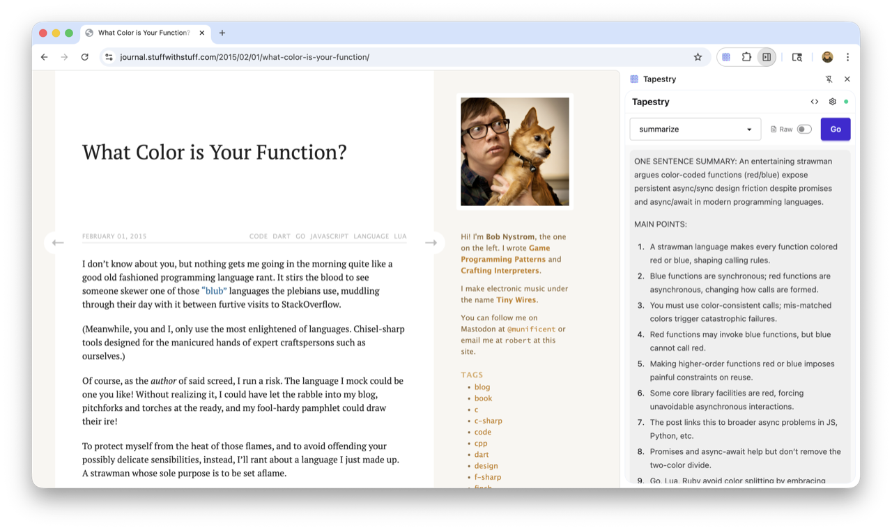

# Tapestry


A browser extension that integrates with [Fabric AI](https://github.com/danielmiessler/fabric) patterns, providing seamless access to AI-powered text processing directly from your browser.

<a href="assets/screenshot.png" target="_blank" title="View full-size screenshot">
  
</a>

Tapestry consists of two components:

- **Browser Extension**: A TypeScript/Svelte extension with sidebar UI for pattern execution
- **Native Host**: A Rust application that bridges the browser extension and Fabric CLI

## Prerequisites

Before installing Tapestry, ensure you have the following installed:

- **Rust** (for building the native host): [Install Rust](https://rustup.rs/)
- **Node.js** (20+) and **pnpm**: [Install Node.js](https://nodejs.org/) then `npm install -g pnpm`
- **Just** (task runner): [Install Just](https://github.com/casey/just#installation)
- **Fabric AI**: [Install Fabric](https://github.com/danielmiessler/fabric#installation)

## Installation

Choose one of two installation methods below:

### Method A: Quick Install (Recommended)

Use pre-built extensions from CI and build only the native host locally.

#### Step 1: Download Pre-built Extension

Download the pre-built extension files from the latest GitHub Actions build:

1. Go to [GitHub Actions](https://github.com/jtdowney/tapestry/actions)
2. Click on the latest successful workflow run
3. Download the appropriate artifact:
   - **Firefox**: Download `tapestry-firefox.xpi` (signed extension)
   - **Chrome**: Download `tapestry-chrome` (unpacked extension folder)

#### Step 2: Install Browser Extension

**Firefox Installation:**
1. Open Firefox and go to `about:addons`
2. Click the gear icon and select "Install Add-on From File..."
3. Select the downloaded `tapestry-firefox.xpi` file
4. Confirm the installation

**Chrome Installation:**
1. Open Chrome and go to `chrome://extensions/`
2. Enable "Developer mode" (toggle in top-right)
3. Click "Load unpacked"
4. Select the extracted `tapestry-chrome` folder

#### Step 3: Build and Install Native Host

```bash
# Clone the repository
git clone https://github.com/jtdowney/tapestry.git
cd tapestry

# Quick install - builds only the native host and installs it
just quick-install-macos-all      # macOS (all browsers)
just quick-install-linux-all      # Linux (all browsers)
just quick-install-windows-all    # Windows (all browsers)

# Or install for specific browsers:
just quick-install-macos-firefox    # macOS Firefox only
just quick-install-macos-chrome     # macOS Chrome only
# (similar commands exist for linux and windows)
```

### Method B: Build Everything from Source

Build both the extension and native host locally.

#### Step 1: Build and Install Everything

```bash
# Clone the repository
git clone https://github.com/jtdowney/tapestry.git
cd tapestry

# Full setup - installs deps, builds everything, and installs native host
just setup-macos      # macOS
just setup-linux      # Linux
just setup-windows    # Windows
```

#### Step 2: Load Built Extension

After running setup, the extension is built in `extension/dist/`:

**Firefox:** Load the extension from `extension/dist/firefox/`
**Chrome:** Load the extension from `extension/dist/chrome/`

Follow the same browser loading steps as in Method A, but use the locally built extension files instead of the downloaded ones.

### Verify Installation

Check that everything is installed correctly:

```bash
# Choose your platform
just status-macos      # macOS
just status-linux      # Linux
just status-windows    # Windows
```

This command will show:
- ✓ Native host binary status
- ✓ Firefox installation status
- ✓ Chrome installation status

## Usage

1. **Open the extension**: Click the Tapestry icon in your browser toolbar or use the sidebar
2. **Configure settings**: Set your Fabric path and preferred AI model in the preferences
3. **Select a pattern**: Choose from available Fabric patterns
4. **Process content**:
   - Capture current page content, or
   - Input custom text
   - Execute the selected pattern

### Using Fabric Contexts

The extension supports Fabric's context feature, which allows you to add pre-defined instructions to all pattern executions.

To use contexts:
1. Create context files in `~/.config/fabric/contexts/`
2. Open Tapestry preferences
3. Select your context from the "Default Context" dropdown
4. All patterns will now include your context instructions

#### Suggested Context: `tapestry`

For optimal rendering in the Tapestry sidebar, we recommend creating a `tapestry` context that ensures markdown formatting:

```bash
# Create ~/.config/fabric/contexts/tapestry
echo "Format your entire response in clean, well-structured Markdown suitable for rendering in a browser extension. Use proper headers, code blocks, lists, and emphasis where appropriate." > ~/.config/fabric/contexts/tapestry
```

This context ensures all Fabric patterns output markdown that renders beautifully in Tapestry's sidebar.

## Development

### Building

```bash
# Build everything
just build

# Build only the native host
just build-host

# Build only the browser extension
just build-extension
```

### Development Mode

```bash
# Watch and rebuild extension (Firefox)
just dev-extension-firefox

# Watch and rebuild extension (Chrome)
just dev-extension-chrome
```

### Testing

```bash
# Run all tests
just test

# Run only host tests
just test-host

# Run only extension tests
just test-extension
```

### Code Quality

```bash
# Format all code
just fmt

# Run all linting and type checking
just check
```

## Platform-Specific Notes

### Windows

- Native messaging manifests are installed via Windows Registry
- Requires administrative privileges for installation
- PowerShell execution policy may need adjustment

### Linux

- Native messaging manifests are stored in user home directory
- Supports both Firefox and Chromium-based browsers
- No special privileges required

### macOS

- Native messaging manifests are stored in `~/Library/Application Support/`
- Works with Firefox, Chrome, and other Chromium-based browsers
- No special privileges required

## Troubleshooting

### Extension Not Connecting to Native Host

1. Verify native host is built: `just build-host`
2. Check installation status: `just status-macos` (or your platform equivalent)
3. Ensure Fabric is installed and accessible in PATH
4. Try reinstalling the native host:
   - **Quick install users**: `just uninstall-macos && just quick-install-macos-all`
   - **Build from source users**: `just uninstall-macos && just install-macos-all`
   - (replace `macos` with your platform: `linux` or `windows`)

### Firefox Extension Issues

1. Ensure you downloaded the signed `.xpi` file
2. Check Firefox's `about:addons` for error messages
3. Verify the extension ID matches the native messaging manifest

### Chrome Extension Issues

1. Ensure Developer Mode is enabled
2. Check for extension errors in `chrome://extensions/`
3. Verify the extension folder contains all necessary files

## Architecture

Tapestry uses Chrome/Firefox native messaging protocol:

1. **Message Flow**: Browser Extension ↔ Native Host (Rust) ↔ Fabric CLI
2. **Communication**: Length-prefixed JSON messages via stdin/stdout
3. **Security**: Native host validates all requests and manages Fabric process execution

## Contributing

1. Fork the repository
2. Create a feature branch
3. Make your changes
4. Run tests and linting: `just check test`
5. Submit a pull request

## License

MIT
